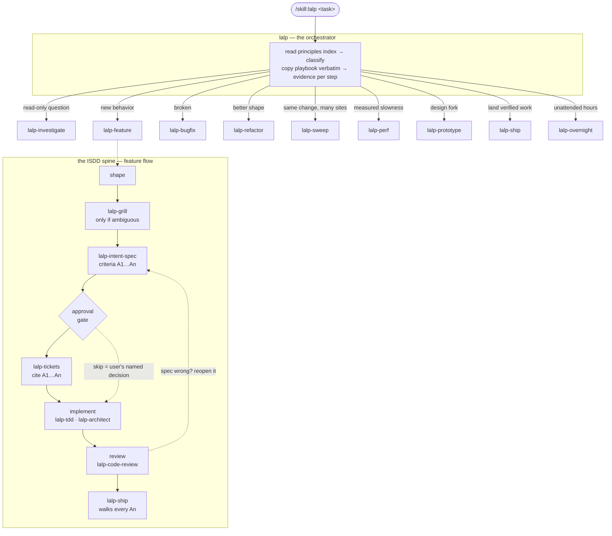

# lalp-skills

A portable, self-contained engineering skill stack built on **Intent Specs Driven Development**, with pstack-style playbooks — plug and play for **pi**, **Claude Code**, and **Codex**. One canonical repo; every harness links to it. No external skill dependencies: everything the stack references lives here.

**28 individually-accessible skills**: the `lalp` orchestrator plus 9 playbooks, 8 principles, and 10 disciplines — each invocable on its own via `/skill:lalp-*`.

## The map — every node is clickable



Open any node to read the actual skill. The gate is the ISDD invariant: no code before the intent spec is approved, and a spec proven wrong is reopened before the code changes.

```
lalp-skills/
├── install.sh               # linker for all harnesses
├── lalp/                    # THE ORCHESTRATOR — classify → route → ISDD spine → principles index
│   └── SKILL.md
├── lalp-investigate/        # PLAYBOOKS — one job each, copied verbatim into the work plan
├── lalp-feature/
├── lalp-bugfix/
├── lalp-refactor/
├── lalp-sweep/
├── lalp-perf/
├── lalp-prototype/
├── lalp-ship/
├── lalp-overnight/
├── lalp-intent-first/       # PRINCIPLES — the rules playbooks lean on (one rule each)
├── lalp-guard-context/
├── lalp-never-block/
├── lalp-build-the-lever/
├── lalp-sequence-units/
├── lalp-root-cause/
├── lalp-smallest-change/
├── lalp-preserve-behavior/
├── lalp-grill/              # DISCIPLINES — the procedures the playbooks call (one method each)
├── lalp-intent-spec/
├── lalp-tickets/
├── lalp-architect/
├── lalp-understand/
├── lalp-tdd/
├── lalp-prove-it-works/
├── lalp-code-review/
├── lalp-teach/
└── lalp-unslop/
```

## The idea — intent specs driven development

One artifact drives everything: the **intent spec**. The intent is captured (why + what must be observably true, never how), approved by the user — the gate — and from there every stage is traced against it: tickets cite acceptance criteria by name, review checks them criterion by criterion, ship walks them with evidence, and a discovered deviation updates the spec before it updates the code. The spec outlives the PR as the decision record.

Around that gate, the mode works pstack-style: it classifies the task, reads the principles index, copies the matching playbook **verbatim** into its work plan (skipped steps stay visible with their reason), and demands evidence at every step.

## Install

```bash
./install.sh                          # symlink all 28 skills into pi, Claude Code, and Codex
HARNESSES="pi claude" ./install.sh    # only some harnesses
./install.sh copy                     # physical copy instead of symlink
./install.sh uninstall                # remove the stack everywhere, incl. stale leftovers
LALP_OVERWRITE=1 ./install.sh         # replace foreign same-name skills without backing up
```

Symlink is the default: edit here, every harness updates instantly. `copy` re-run refreshes.

### Safety guarantees

The installer **never deletes anything it did not create**:

- **Name collisions are backed up, not clobbered.** If you already have your own `~/.agents/skills/lalp-tdd/`, it is moved to `~/.lalp-skills-backup/<harness>/<name>.<timestamp>/` and reported before this stack's version is installed. Set `LALP_OVERWRITE=1` to replace without backing up.
- **Stale leftovers are swept on every run**, not just on uninstall. Renamed or dropped skills, and dangling symlinks from a version downgrade or a moved repo, are cleaned up automatically.
- **Live symlinks pointing elsewhere are left alone.** A dangling symlink holds no data and is safe to remove; a symlink resolving to real content outside this repo is treated as yours and never touched.
- **Unrelated skills are never touched.** `uninstall` removes only entries this installer created (a symlink into this repo, a dangling symlink, or a copy carrying the `.luis-skills` marker).
- **`HARNESSES` is validated against an allowlist** (`pi`, `pi-native`, `claude`, `codex`); anything else aborts rather than writing to an arbitrary path.

## How to use

### 1. Enter the mode (orchestrator)

| Harness | How to enter the mode |
| --- | --- |
| pi | `/skill:lalp <task>` — or ask the agent to load `~/.agents/skills/lalp/SKILL.md` |
| Claude Code | "use the lalp skill" or reference `~/.claude/skills/lalp/SKILL.md` |
| Codex | reference `~/.codex/skills/lalp/SKILL.md` in your prompt or `AGENTS.md` |

The prompt shape the mode likes:

```
/skill:lalp <what you observed or what you want>
Done means <something the agent can run or inspect>.
Keep <existing behavior that must not change>.
```

Examples:

```
/skill:lalp add retry with backoff to the webhook client
Done means the flaky-server test passes. Keep the public API unchanged.

/skill:lalp the CLI panics on an empty config file
Done means the repro command exits 0 and a regression test guards it.

/skill:lalp how does the auth middleware decide a token is stale?
(read-only — routes to lalp-investigate, no code)
```

### 2. Use individual skills directly

Every playbook, principle, and discipline is its own skill — invoke it directly without going through the orchestrator:

```
/skill:lalp-bugfix the login page crashes on empty email
/skill:lalp-grill I want to add auth but I'm not sure what scope makes sense
/skill:lalp-tdd implement the retry logic with tests first
/skill:lalp-code-review review this diff before I commit
/skill:lalp-ship let's land the webhook retry work
/skill:lalp-intent-spec write a spec for the caching layer
/skill:lalp-investigate how does the session middleware work?
/skill:lalp-unslop clean up the PR description
```

This works for focused tasks where you don't need the full orchestrator routing. The orchestrator (`lalp`) references these same skills by name when it routes a task.

### 3. What the mode does

It classifies your task, reads the principles index, and copies the matching playbook **verbatim** into its work plan — skipped steps stay visible with their reason. For new behavior it walks the ISDD spine: shape → grill (only if ambiguous) → intent spec → **approval gate** → tickets → implement → review → ship. Every step ends in evidence (the command and its output), not claims.

### 4. Your part — the gate

The one place the mode stops for you: the intent spec. The agent presents intent, observable contract, acceptance criteria (A1…An), and out of scope — written to `specs/<name>.md` — and waits:

- **Approve** — "approved" / "go ahead" → implementation starts, and every later stage cites the criteria by name.
- **Push back** — the spec changes and the gate reopens. Cheaper now than after code exists.
- **Skip** — only your named decision, on small obvious changes ("skip the spec, just fix it"). Never the agent's.
- If implementation later proves the spec wrong, the spec is reopened and re-approved *before* the code changes.

### 5. Steering mid-run

- **Sticky**: once entered, the mode stays on across turns until the work lands or you opt out ("drop the mode").
- **New topic**: say `new task` and the mode re-classifies.
- **Class changes**: a feature can uncover a bug mid-flight — the agent names the switch, loads the new playbook, and keeps the evidence gathered so far.

### 6. Optional host-side extras

The mode can use these when the host provides them (optional, not bundled): subagents (arena/swarm), `paseo-committee` / `paseo-advisor` / `paseo-handoff`, `agentic-coding` for model routing, and a dedicated UI router (e.g. the locon stack's `locon-run`) for UI-shaped handoffs.

## How skill cross-references resolve

Each sub-skill that references other skills includes a resolution hint at the top:

> Skills named below are sibling skills. To load one, `read` its `SKILL.md` from the same directory this skill lives in.

So when `lalp-feature` references `lalp-grill`, the agent derives the skills directory from its own path (`~/.agents/skills/lalp-feature/SKILL.md` → `~/.agents/skills/`) and reads `~/.agents/skills/lalp-grill/SKILL.md`. This works regardless of which harness installed the skills (pi, Claude Code, Codex) — they all end up as siblings in the same directory.

## Security notes

Audited for hidden characters, injection patterns, network/exfiltration primitives, and destructive commands. The stack is pure markdown plus one installer: no executables, no dependencies, no network calls, no credential access, no `allowed-tools` pre-approval (so normal harness permission prompts still apply).

Things worth understanding before you install:

- **Skills are instructions, and the model obeys them.** Review the content you install. In `link` mode the installed skills are symlinks into a git working tree, so `git pull` or `git checkout` instantly changes what every harness's agent reads — across all projects, without touching harness config. Pin to a tag if you want a stable, reviewable surface, or use `copy` mode and re-review on refresh.
- **This stack deliberately widens agent autonomy.** `lalp-never-block` says proceed-and-report rather than ask first, and `lalp-overnight` runs unattended for hours. Both keep hard stops on irreversible actions (deletes, publishes, force-pushes), but the net effect is fewer human checkpoints. That raises the leverage of any prompt injection arriving through *untrusted content the agent reads* — a malicious README, issue, or dependency during `lalp-investigate`. `lalp-guard-context` (bulk reading delegated to isolated subagents) partially mitigates this.
- **All 28 skills are model-invocable.** None set `disable-model-invocation`, so they appear in the system prompt and the model may load them on description match without you asking. Add `disable-model-invocation: true` to any skill's frontmatter to make it `/skill:`-only.
- **`lalp-sweep` and `lalp-build-the-lever` instruct the agent to write and run scripts/codemods.** That is the highest-privilege behavior here. Both require a dry run and a reviewed diff before applying.

## Portability rules (why it works everywhere)

- **28 skills**: the repo exposes `lalp` (the orchestrator) plus 27 individual skills (`lalp-*`), each with its own `SKILL.md` and valid frontmatter.
- **Agent Skills standard frontmatter** only: `name`, `description`.
- **Skill names are self-describing**: `lalp-feature`, `lalp-tdd`, `lalp-root-cause` — you know what you're loading.
- **Cross-references use skill names**, not file paths — `lalp-grill` instead of `../../disciplines/grill/SKILL.md`. Works regardless of install layout.
- **Resolution hint** in each referencing skill tells the agent how to find siblings.
- **Never `colon+space` inside a description** — it breaks YAML parsing of unquoted frontmatter and pi silently drops the skill.
- Pure markdown — no scripts, no executables, no network. Safe to vendor anywhere.

## Inspirations

- **Matt Pocock's skills — [The Main Flow](https://www.aihero.dev/skills)**: idea→ship spine (shape → grill → spec → tickets → implement → review), the spec approval gate and spec-as-decision-record, context-window discipline ("smart zone", fresh-context subagent reviews).
- **pstack by poteto** ([cursor/plugins](https://github.com/cursor/plugins/tree/main/pstack)): the mode router with playbooks, the principles index, verbatim playbook copy, arena/swarm parallelism, prototype/ship/overnight playbooks — and the **architect**, **teach**, and **unslop** skills, adapted here (Cursor model routing stripped, wired into the ISDD spine).
