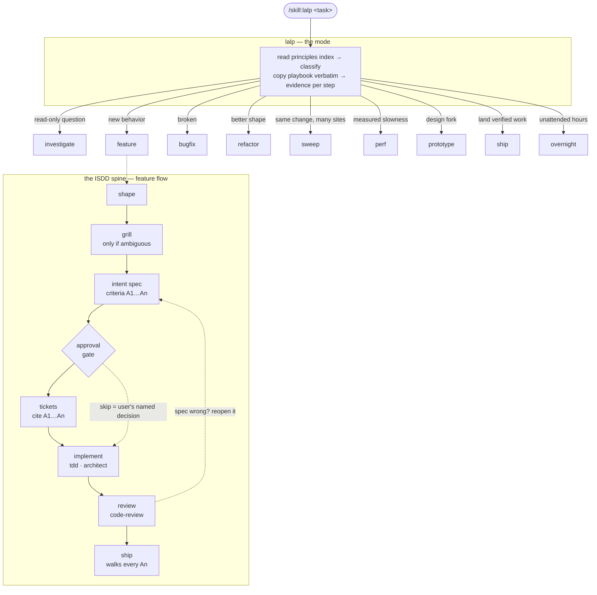

# lalp-skills

A portable, self-contained engineering skill stack built on **Intent Specs Driven Development**, with pstack-style playbooks — plug and play for **pi**, **Claude Code**, and **Codex**. One canonical repo; every harness links to it. No external skill dependencies: everything the stack references lives here.

## The map — every node is clickable



Open any node to read the actual playbook or discipline. The gate is the ISDD invariant: no code before the intent spec is approved, and a spec proven wrong is reopened before the code changes.

```
lalp-skills/
├── install.sh            # linker for all harnesses
└── lalp/                 # THE MODE — one skill, the whole stack
    ├── SKILL.md          #   classify → route → the ISDD spine → principles index
    ├── playbooks/        #   investigate, feature, bugfix, refactor, sweep, perf, prototype, ship, overnight
    ├── principles/       #   intent-first, guard-context, never-block, build-the-lever, sequence-units,
    │                     #   root-cause, smallest-change, preserve-behavior
    └── disciplines/      #   grill, intent-spec, tickets, architect, understand, tdd, prove-it-works,
                          #   code-review, teach, unslop
```

## The idea — intent specs driven development

One artifact drives everything: the **intent spec**. The intent is captured (why + what must be observably true, never how), approved by the user — the gate — and from there every stage is traced against it: tickets cite acceptance criteria by name, review checks them criterion by criterion, ship walks them with evidence, and a discovered deviation updates the spec before it updates the code. The spec outlives the PR as the decision record.

Around that gate, the mode works poteto-mode style: it classifies the task, reads the principles index, copies the matching playbook **verbatim** into the work plan (skipped steps stay visible with their reason), and demands evidence at every step.

## Install

```bash
./install.sh                          # symlink lalp into pi, Claude Code, and Codex
HARNESSES="pi claude" ./install.sh    # only some harnesses
./install.sh copy                     # physical copy instead of symlink
./install.sh uninstall                # remove the stack everywhere, incl. stale leftovers
```

Symlink is the default: edit here, every harness updates instantly. `copy` re-run refreshes.

`uninstall` removes the stack plus leftovers from older versions (renamed/dropped skills), whether they were linked or copied — but never touches skills that don't belong to this stack.

## How to use

### 1. Enter the mode

| Harness | How to enter the mode |
| --- | --- |
| pi | `/skill:lalp <task>` — or ask the agent to load `~/.agents/skills/lalp/SKILL.md` |
| Claude Code | "use the lalp skill" or reference `~/.claude/skills/lalp/SKILL.md` |
| Codex | reference `~/.codex/skills/lalp/SKILL.md` in your prompt or `AGENTS.md` |

The prompt shape the mode likes:

```
/skill:lalp <what you observed or what you want>
Done means <something the agent can run or inspect>.
Keep <existing behavior that must not change>.
```

Examples by task shape:

```
/skill:lalp add retry with backoff to the webhook client
Done means the flaky-server test passes. Keep the public API unchanged.

/skill:lalp the CLI panics on an empty config file
Done means the repro command exits 0 and a regression test guards it.

/skill:lalp how does the auth middleware decide a token is stale?
(read-only — investigate playbook, no code)

/skill:lalp ship the webhook retry work
(ship walks every acceptance criterion with evidence before landing)
```

### 2. What the mode does

It classifies your task, reads the principles index, and copies the matching playbook **verbatim** into its work plan — skipped steps stay visible with their reason. For new behavior it walks the ISDD spine: shape → grill (only if ambiguous) → intent spec → **approval gate** → tickets → implement → review → ship. Every step ends in evidence (the command and its output), not claims.

### 3. Your part — the gate

The one place the mode stops for you: the intent spec. The agent presents intent, observable contract, acceptance criteria (A1…An), and out of scope — written to `specs/<name>.md` — and waits:

- **Approve** — "approved" / "go ahead" → implementation starts, and every later stage cites the criteria by name.
- **Push back** — the spec changes and the gate reopens. Cheaper now than after code exists.
- **Skip** — only your named decision, on small obvious changes ("skip the spec, just fix it"). Never the agent's.
- If implementation later proves the spec wrong, the spec is reopened and re-approved *before* the code changes.

### 4. Steering mid-run

- **Sticky**: once entered, the mode stays on across turns until the work lands or you opt out ("drop the mode").
- **New topic**: say `new task` and the mode re-classifies.
- **Class changes**: a feature can uncover a bug mid-flight — the agent names the switch, loads the new playbook, and keeps the evidence gathered so far.

### 5. Optional host-side extras

The mode can use these when the host provides them (optional, not bundled): subagents (arena/swarm), `paseo-committee` / `paseo-advisor` / `paseo-handoff`, `agentic-coding` for model routing, and a dedicated UI router (e.g. the locon stack's `locon-run`) for UI-shaped handoffs.

## Portability rules (why it works everywhere)

- **One skill**: the repo exposes exactly one top-level skill — `lalp`. Playbooks, principles, and disciplines are reference files it loads by relative path.
- **Agent Skills standard frontmatter** only: `name`, `description`, `disable-model-invocation`.
- **Dir name = skill name**, as the strict standard requires.
- **Never `colon+space` inside a description** — it breaks YAML parsing of unquoted frontmatter and pi silently drops the skill.
- All references are relative paths that survive any install location.
- Pure markdown — no scripts, no executables, no network. Safe to vendor anywhere.

## Inspirations

- **Matt Pocock's skills — [The Main Flow](https://www.aihero.dev/skills)**: idea→ship spine (shape → grill → spec → tickets → implement → review), the spec approval gate and spec-as-decision-record, context-window discipline ("smart zone", fresh-context subagent reviews).
- **pstack by poteto** ([cursor/plugins](https://github.com/cursor/plugins/tree/main/pstack)): the mode router with playbooks, the principles index, verbatim playbook copy, arena/swarm parallelism, prototype/ship/overnight playbooks — and the **architect**, **teach**, and **unslop** skills, adapted here (Cursor model routing stripped, wired into the ISDD spine).
